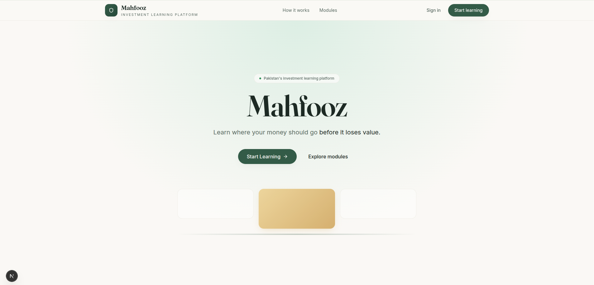
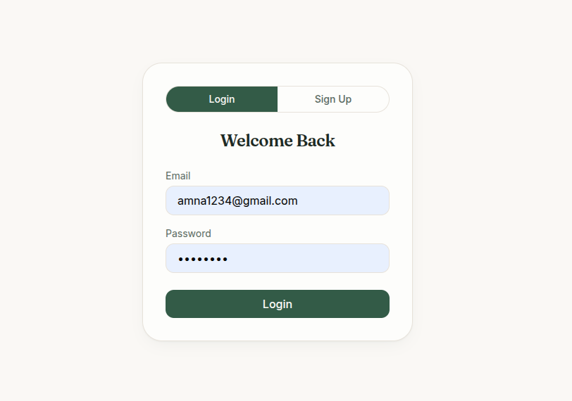
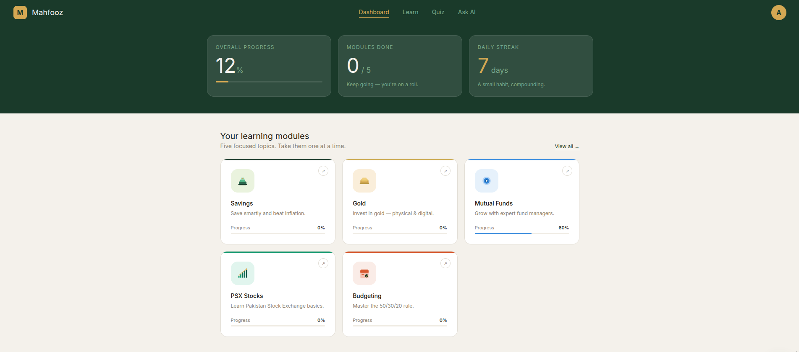
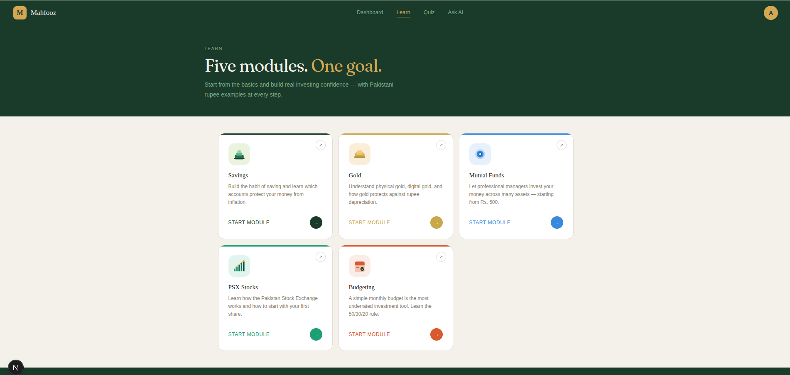
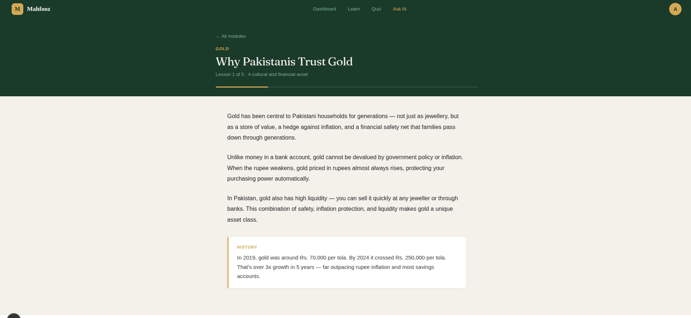
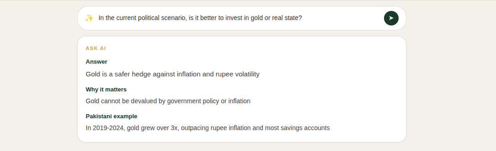
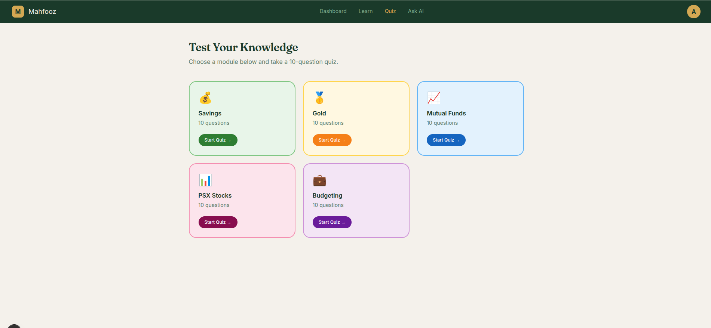
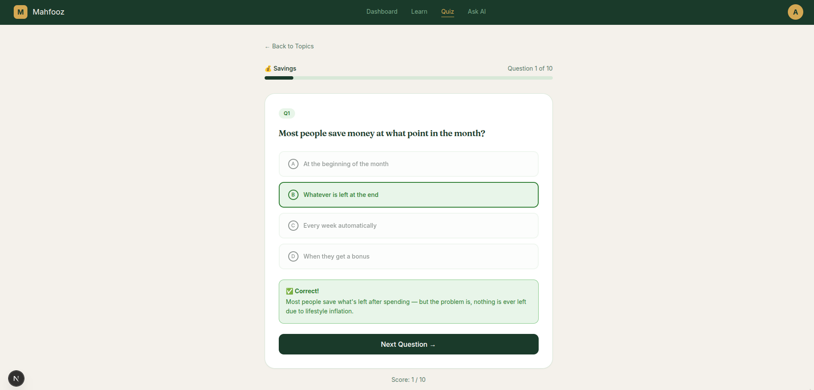

# Mahfooz

Mahfooz is a semester project built as a simple investment learning platform for Pakistanis. It helps beginners understand savings, gold, mutual funds, PSX stocks, and budgeting in plain language with local rupee-based examples.

The product is educational only. It does not handle real money, execute trades, or provide personalized financial advice.

## Project Overview

Mahfooz is designed around a simple learning flow:

- users create an account with Supabase Auth
- they explore five learning modules
- lesson progress is tracked per module
- they can ask the AI topic-specific questions inside each module
- they test themselves with module quizzes

## Tech Stack

- `Next.js 15`
- `React 18`
- `Tailwind CSS`
- `Supabase` for authentication and data
- `Groq API` for the module AI assistant

## Core Features

- Landing page with clear product positioning
- Signup and login flow with Supabase
- Dashboard with progress tracking
- Five learning modules:
  - Savings
  - Gold
  - Mutual Funds
  - PSX Stocks
  - Budgeting
- Module-level AI assistant restricted to the current topic
- Quiz experience with instant feedback

## Local Setup

Clone the repo and run the app from the `mahfooz` folder:

```bash
cd /home/amna/Mehfooz/mahfooz
npm install
npm run dev
```

The app will be available at:

```text
http://localhost:3000
```

## Environment Variables

Create a `.env.local` file based on `.env.example`.

Required variables:

```env
NEXT_PUBLIC_SUPABASE_URL=your_supabase_project_url
NEXT_PUBLIC_SUPABASE_ANON_KEY=your_supabase_anon_key
GROQ_API_KEY=your_groq_api_key
```

## Project Structure

```text
mahfooz/
├── app/
│   ├── api/
│   ├── auth/
│   ├── dashboard/
│   ├── learn/
│   └── quiz/
├── components/
├── data/
├── images/
├── lib/
├── public/
└── styles/
```

## Screenshots

### Landing Page

Shows the product identity, hero section, and top-level call to action for new users.



### Authentication Screen

Shows the login and signup interface used for Supabase authentication.



### User Dashboard

Shows overall progress, module completion summary, and access to all learning modules.



### Modules Overview

Shows the five learning modules available to the user from the Learn page.



### Gold Module Lesson Page

Shows a lesson screen with topic content, progress tracking, and module navigation.



### Ask AI Response

Shows the module-level AI assistant answering a user question in structured format.



### Quiz Topic Selection

Shows the quiz module selection screen before starting a topic-specific quiz.



### Quiz Question Screen

Shows a live quiz question with answer feedback and progress bar.



## Current Notes

- The AI assistant is restricted by module context.
- The app is intended for learning and demonstration purposes.
- Security and dependency updates should be reviewed before production deployment.

## Authors

Mahfooz semester project team.
